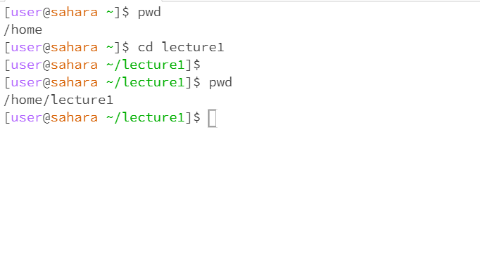
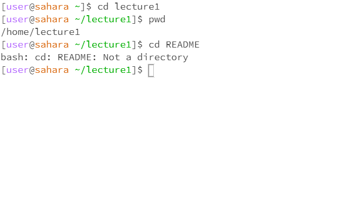
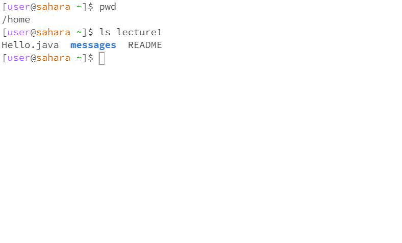
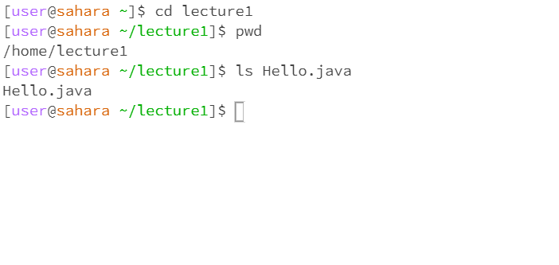
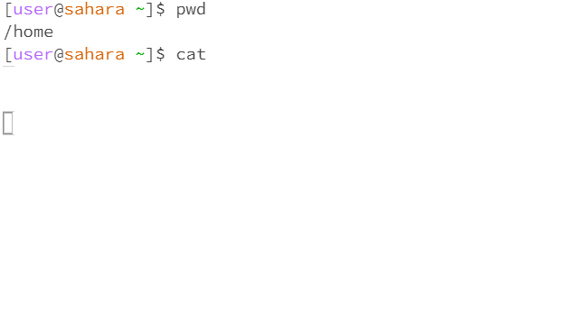
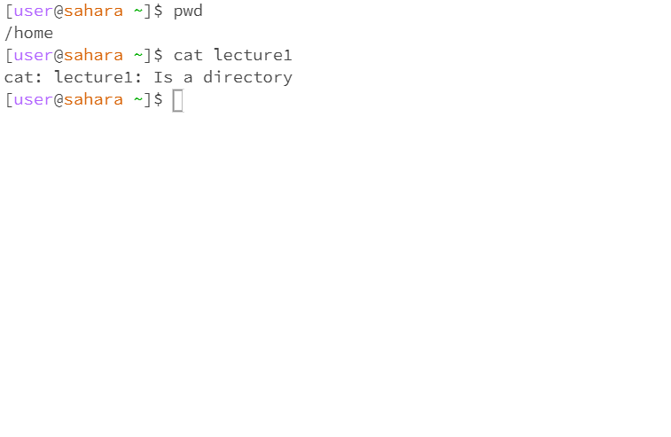
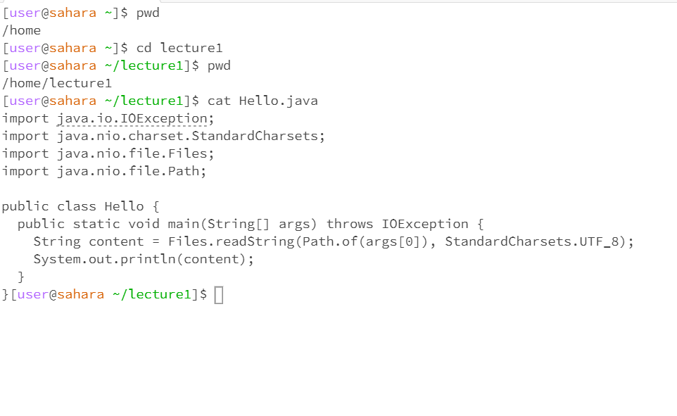

# Lab Report 1

## cd 

**cd with no argument**

 

> The working directory was home and when I entered the cd command with no argument nothing happened because the cd command is used to change the working directory; however, in order to do that it needs to have a directory listed as an argument otherwise it will do nothing.

**cd with a directory as an argument**

> The working directory was /home and when I entered the command cd with the directory lecture1 listed as an argument it changed the working directory to /home/lecture1. This is because cd is used to change the working directory.

**cd with a file as an argument**

> The working directory was /home/lecture1 and when I entered in the README file as an argument for the cd command it gave me an error. This is because cd is used to change the current working directory and a file is not a directory.

---

##ls

**ls with no argument**

> The working directory was /home and when entering ls with no arguments the output was lecture1. This is because ls is used to list files and directories that happen to be in the directory and lecture1 was the only thing in the /home working directory.

 **ls with directory as an argument**

 

 > The working directory was /home and when lecture1 was entered in as a directory argument for the command ls it returned all of the files and directories in the lecture1 directory because it is used to list all of the files and directories in a directory.

**ls with a file as an argument**

> The working directory was /home/lecture1 and when the file Hello.java was entered as an argument it returned the name of the file because it is the only thing that could be in a path file. Due to path files not containing paths for other files or directories.

---

##cat

**cat with no argument**

> The working directory was /home and when the cat command was entered with no argument nothing was returned because the cat command reads out whatever is in the file that it is fed as an argument and due to being given nothing it returned nothing.

**cat with a directory as an argument**

> The working directory was /home and when the directory lecture1 was entered as an argument it returned an error because cat is used to read files and a directory is not a file.

**cat with a file as an argument**

> The working directory was /home/lecture1 and when I entered in the file Hello.java as an argument it returned the entire contents of the code of Hello.java because cat is supposed to read out the parameters which in this case is the code of the file it is given.  

 

